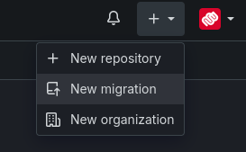
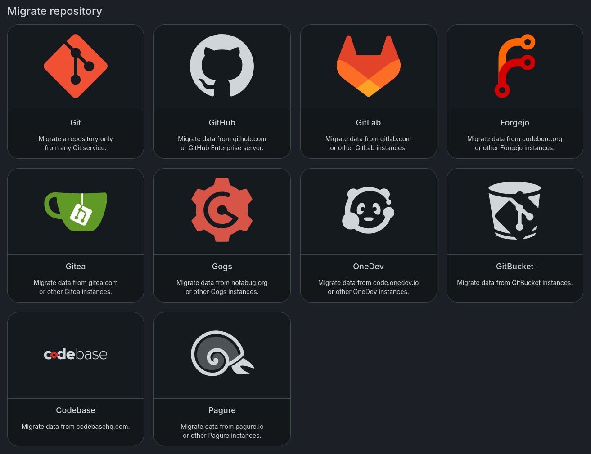
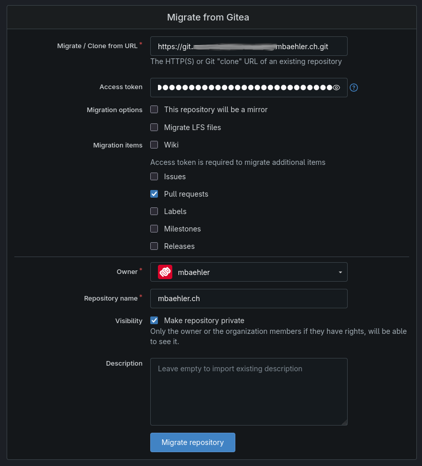

I've been using Gitea for a few years now in my homelab. Mainly to manage my Ansible playbooks and roles and some personal projects. I've been very happy with it and never had any problems. But in 2022 Gitea became part of a profit oriented company, which might have impact on the future of the project. Also Gitea is developed completely in a [GitHub repository](https://github.com/go-gitea/gitea), which I always found a little weird. Why wouldn't they use their own project? Forgejo on the other hand host their project on [Codeberg](https://codeberg.org/forgejo/forgejo) which is actually running on Forgejo itself.

You can read more about Forgejo and why it was created [here](https://forgejo.org/compare-to-gitea/#why-was-forgejo-created)

I decided to give it a try, but now I needed to migrate my data from my old Gitea instance to my new Forgejo server. There are several ways to achieve this, but the direct upgrade part to switch from Gitea to Forgejo is no longer working in newer Forgejo releases. Since I only host very few repositories I used the builtin migrations feature and just cloned my repositories to my Forgejo instance, which worked flawless.

# Migrate data

Start a new migration

Choose Gitea as source (kinda obvious)

Enter the path of your source repository. You don't need mirroring if you want to use Forgejo as your new origin.
Choose everything you need to migrate.


**Warning!** Do not include stuff you don't have in the source, if you do the migration will fail.


All the data from your old repository should now be on the new server. To make sure your future commits will be pushed to the new server, all you need to do is edit the origin in your cloned repositories. Therefore you need to edit **.git/config** and just change the URL under **remote "origin"**
