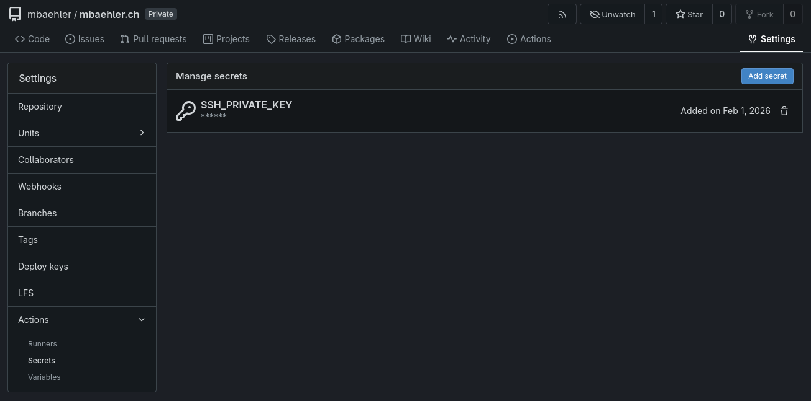
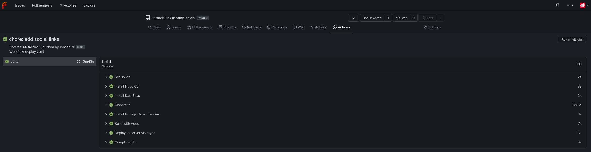

A few days ago I wanted to finally have my own website again. I've had one a few years ago but never really used it that much. I thought it would be a nice opportunity to host a little blog and some photos I've taken. So I started looking for something new to create a website with. In the last few years I've used WordPress alot but I don't really like that I have to keep up with all those security issues, plugin updates etc. I just want something simple, that can be hosted in a Podman (or Docker) container and managed via my own git repository.

So I discovered [Hugo](https://gohugo.io/) a nice open source static website generator mainly based on the [Markdown language](https://www.markdownguide.org/) together with the very nice and customizable [Blowfish theme](https://blowfish.page/). I really like the idea of using Markdown to write my own blog posts since I'm used to it from other services like [Obsidian](https://obsidian.md/) already.

I really like the way it's setup and how I can easily manage it inside a git repository. But after a few hours of testing around and creating my website I wanted to upload it to my Podman webserver.

# Creating the Podman Container

I wrote a little compose file using the very lightweight Nginx Alpine image to host my website.

```YAML
---

services:
  mbaehler:
    image: docker.io/nginx:alpine
    container_name: mbaehler.ch
    environment:
      - NGINX_HOST=mbaehler.ch
      - NGINX_PORT=80
    volumes:
      - ./public:/usr/share/nginx/html/
    ports:
      - 8010:80
    restart: unless-stopped

```

Now all I have to do to make the website available is to copy the content of the public folder generated by Hugo into the public folder in the working directory of the compose file and my website shows up. So far so good, but I don't want to manually do this every time I update something on my website. So I looked for a way to integrate this into a git action.

# Git Action

I let my git action generate the data for the server before it copies the files over via SCP, so I don't have to host the whole public folder and other unnecessary stuff like the data from the theme in my git repository. Therefore I made sure to exclude some stuff from the git repo. Here's my .gitignore file.

```Ini
#others
node_modules
.hugo_build.lock

# OS generated files
.DS_Store
.DS_Store?
._*
.Spotlight-V100
.Trashes

# Hugo
public
```

The following git action resides in the repository under `.gitea/workflows/deploy.yaml` it runs automatically as soon as I push something into the main branch. I can also make sure it uses the correct version of Hugo that I know works well with my theme and my website. If I test changes or a new Hugo version locally and want to apply it on my real website all I have to do is push to main and let the action do its work.

It runs a rootless Podman container and downloads the latest main branch of my repository, sets up Hugo and all needed dependencies, then builds the new version of the website and copies it to the server via SCP.

It uses a SSH key to connect to the server via SCP, it is specified like this in the last task: `${{ secrets.SSH_PRIVATE_KEY }}` the private key needs to be saved as a git secret. In Forgejo this can be configured via the repository settings -> Actions -> Secrets



```YAML
---

name: Deploy Hugo Site to Webserver

on:
  # Runs on pushes targeting the default branch
  push:
    branches:
      - main

# Default to bash
defaults:
  run:
    shell: bash

jobs:
  # Build job
  build:
    runs-on: ubuntu-latest
    env:
      DART_SASS_VERSION: 1.97.3
      HUGO_VERSION: 0.154.5
      HUGO_ENVIRONMENT: production
      TZ: <Your timezone eg. Europe/Zurich>
    steps:
      - name: Install Hugo CLI
        run: |
          wget -O ${{ runner.temp }}/hugo.deb https://github.com/gohugoio/hugo/releases/download/v${HUGO_VERSION}/hugo_extended_${HUGO_VERSION}_linux-amd64.deb
          dpkg -i ${{ runner.temp }}/hugo.deb
      - name: Install Dart Sass
        run: |
          wget -O ${{ runner.temp }}/dart-sass.tar.gz https://github.com/sass/dart-sass/releases/download/${DART_SASS_VERSION}/dart-sass-${DART_SASS_VERSION}-linux-x64.tar.gz
          tar -xf ${{ runner.temp }}/dart-sass.tar.gz --directory ${{ runner.temp }}
          mv ${{ runner.temp }}/dart-sass/ /usr/local/bin
          echo "/usr/local/bin/dart-sass" >> $GITHUB_PATH
      - name: Checkout
        uses: actions/checkout@v4
        with:
          submodules: recursive
          fetch-depth: 0
      - name: Install Node.js dependencies
        run: "[[ -f package-lock.json || -f npm-shrinkwrap.json ]] && npm ci || true"
      - name: Build with Hugo
        run: |
          hugo \
            --gc \
            --minify

  # Deployment job - working config
      - name: Deploy to server via rsync
        uses: https://github.com/appleboy/scp-action@v1
        with:
          host: <your local podman / docker server>
          username: <ssh username>
          key: ${{ secrets.SSH_PRIVATE_KEY }}
          port: 22
          source: ./public/*
          target: <path to your compose file>/public/
          strip_components: 1

```

Now when I'll push this blogpost to my main branch the action will run and a few minutes later you can read it on my blog 😃



Maybe the next step could be to automatically post to Mastodon, that a new blog post has been added... 🤔