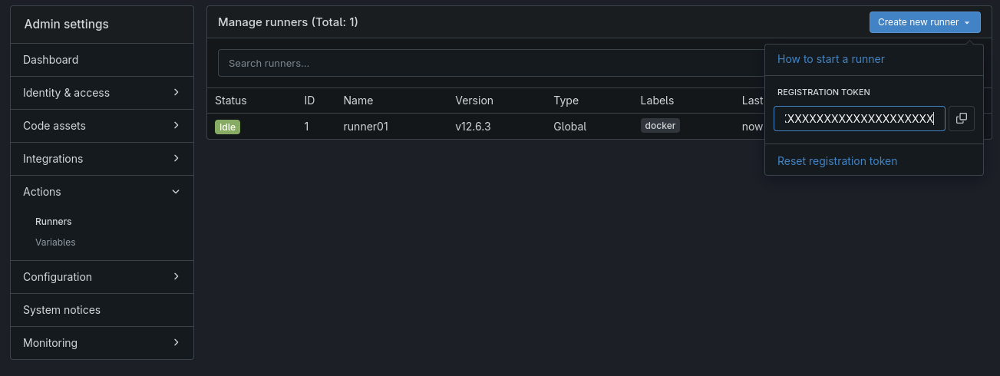
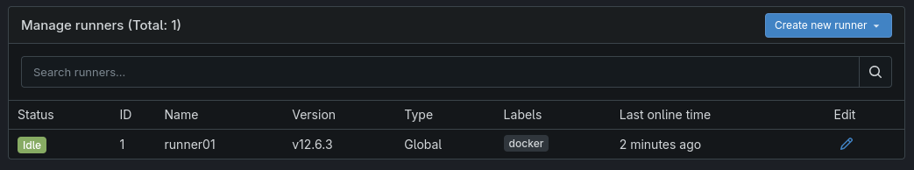

By default the Forgejo runners usually need access to the Docker socket to be able to run actions in containers. It's also possible to do this with rootless Podman containers but needs to be configured this way.

# Prerequisites

Create a user in which the runner will be installed.

 root:# 

```Bash
adduser podman_runner
```

Enable the user to run systemd Services even when not logged in.

```Bash
loginctl enable-linger podman_runner
``` 

# Install the runner

Login as the new user and install the Forgejo runner.

 podman_runner:$ 

```Bash
export ARCH=$(uname -m | sed 's/x86_64/amd64/;s/aarch64/arm64/')
export RUNNER_VERSION=$(curl -X 'GET' https://data.forgejo.org/api/v1/repos/forgejo/runner/releases/latest | jq .name -r | cut -c 2-)
export FORGEJO_URL="https://code.forgejo.org/forgejo/runner/releases/download/v${RUNNER_VERSION}/forgejo-runner-${RUNNER_VERSION}-linux-${ARCH}"
wget -O forgejo-runner ${FORGEJO_URL} || curl -o forgejo-runner ${FORGEJO_URL}
chmod +x forgejo-runner
wget -O forgejo-runner.asc ${FORGEJO_URL}.asc || curl -o forgejo-runner.asc ${FORGEJO_URL}.asc
gpg --keyserver hkps://keys.openpgp.org --recv EB114F5E6C0DC2BCDD183550A4B61A2DC5923710
gpg --verify forgejo-runner.asc forgejo-runner && echo "✓ Verified" || echo "✗ Failed"
```

 root:# 

```Bash
cp /home/podman_runner/forgejo-runner /usr/local/bin/forgejo-runner
```

Test if the runner is executable

 podman_runner:$ 

```Bash
forgejo_runner -v
```

It should output a version number.

# Register the runner

For the runner to be usable it needs to be registered with the Forgejo instance first. This will create a .runner file in the current directory (userhome)

First a runer token needs to be obtained in the admin settings of Forgejo or in your repository or organization, depending on what the runner should be used for. The creation of the token directly in the admin settings creates a globally useable runner.



 podman_runner:$ 

```Bash
forgejo-runner register
```

```
forgejo-runner register
INFO Registering runner, arch=amd64, os=linux, version=v12.6.3. 
WARN Runner in user-mode.                         
INFO Enter the Forgejo instance URL (for example, https://next.forgejo.org/): 
https://git.example.com
INFO Enter the runner token:                      
XXXXXXXXXXXXXXXXXXXXXXXXXXXXXXXXXXXXXXXXXXXX
INFO Enter the runner name (if set empty, use hostname: gitserver): 
runner01
INFO Enter the runner labels, leave blank to use the default labels (comma-separated, for example, ubuntu-20.04:docker://node:20-bookworm,ubuntu-18.04:docker://node:20-bookworm): 

INFO Registering runner, name=runner01, instance=https://git.example.com, labels=[docker:docker://data.forgejo.org/oci/node:lts]. 
DEBU Successfully pinged the Forgejo instance server 
INFO Runner registered successfully.              
```

The runner should now show up in the Forgejo admin settings



# Create and enable Systemd Service

Enable the Podman socket for the runner user.

 podman_runner:$ 

```Bash
systemctl --user enable --now podman.socket
```

Create the default runner configuration file.

```Bash
forgejo-runner generate-config > config.yaml
```


**Warning!** If Podman runs on the same host as the Forgejo instance, the network mode in the config.yaml needs to be set to host, otherwise the runner will not be able to connect to the Forgejo server.


To set host networking change the following in the generated config.yaml file.

```
network: "host"
```

 root:# 

Now create the file **/etc/systemd/system/forgejo-runner.service** with the following content:

```Ini
[Unit]
Description=Forgejo Runner
Documentation=https://forgejo.org/docs/latest/admin/actions/

[Service]
Environment=DOCKER_HOST=unix:///run/user/<USERID>/podman/podman.sock
ExecStart=/usr/local/bin/forgejo-runner daemon --config /home/podman_runner/config.yaml
ExecReload=/bin/kill -s HUP $MAINPID

# This user and working directory must already exist
User=podman_runner 
WorkingDirectory=/home/podman_runner
Restart=on-failure
TimeoutSec=0
RestartSec=10

[Install]
WantedBy=multi-user.target
```

Reload the Systemd daemon and start the service

```Bash
systemctl daemon-reload
systemctl start forgejo-runner.service
```

Check the status of the service

```Bash
systemctl status forgejo-runner.service
```

If everything works correctly, enable the service that it starts automatically.

```Bash
systemctl enable forgejo-runner.service
```